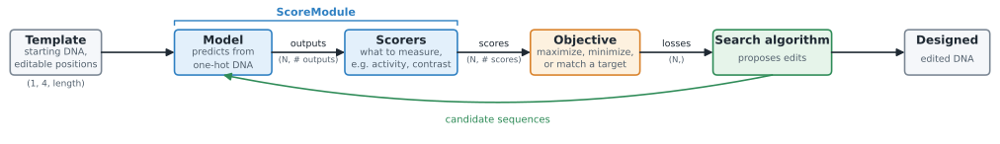

# Model-guided sequence design

Model-guided sequence design uses trained genomic sequence-to-function models to guide a search through DNA sequence space. Model predictions are used to evaluate candidate sequences and select edits that improve a specified goal.

The workflow starts with a trained model and a template sequence to edit. The template can be any valid DNA sequences such as randomly generated DNA or a natural sequence extracted from a reference genome, with a length that matches the model's input requirements.

- **Scorers** define what to measure from model predictions, such as activity or a difference between outputs.
- **Objectives** define the goals for those measurements, such as increasing activity or matching a target value.
- **Search algorithms** determine how candidate edits are proposed and explored. Approaches include greedy substitution, gradient-based optimization, and genetic algorithms.



Example scripts are provided in `examples/design_*`: [design_single_model.py](../examples/design_single_model.py), [design_two_models.py](../examples/design_two_models.py), and [design_cherimoya.py](../examples/design_cherimoya.py).

The following code blocks form one workflow. They assume you already have a loaded model called `trained_model`. This example selects a single scalar output from a model returning `(profiles, counts)`, as in [design_single_model.py](../examples/design_single_model.py).

## 1. Prepare the model output

```python
import torch

from regseqkit.design import Objective, greedy_substitution
from regseqkit.scoring import ScalarScorer, ScoreModule
from regseqkit.sequences import OneHotEncoder


class CountWrapper(torch.nn.Module):
    def __init__(self, model):
        super().__init__()
        self.model = model

    def forward(self, X):
        profiles, counts = self.model(X)
        return counts


device = "cpu"  # Or "cuda:0".
wrapped_model = CountWrapper(trained_model).to(device).float().eval()
```

The model receives one-hot DNA shaped `(N, 4, length)` in ACGT order. The wrapper selects the scalar prediction tensor shaped `(N, outputs)`; the scorer needs this tensor rather than a tuple of model heads. If your model already returns the required tensor, use it directly without `CountWrapper`.

## 2. Define the scorer

```python
scorer = ScalarScorer(weights=[1.0])
```

A scorer defines what to measure from the predictions. This scorer returns the model's single scalar output unchanged. It takes predictions shaped `(N, 1)` and returns scores shaped `(N,)`.

For a model with multiple scalar outputs, supply one weight per output in tensor-column order. `[1.0, 0.0]` selects the first of two outputs; `[-1.0, 1.0]` measures the second minus the first. A scorer computes the quantity; it does not specify whether to increase or decrease it.

## 3. Define the objective and score module

```python
objective = Objective(scorer, mode="maximize")
score_module = ScoreModule(wrapped_model, objective.scorers)
```

An objective defines the goal for a score. It returns one loss per sequence, and the optimizer minimizes that loss.

| Objective | Loss | Goal |
| --- | --- | --- |
| `Objective(scorer, mode="maximize")` | `-score` | Increase the score |
| `Objective(scorer, mode="minimize")` | `score` | Decrease the score |
| `Objective(scorer, mode="match", target=2.0)` | `(score - 2.0)**2` | Approach a target value |

`ScoreModule` joins the model and scorers. It accepts sequences, runs the model once, and returns score columns shaped `(N, number_of_scorers)`. `objective.scorers` supplies the required scorer objects in the order the objective expects. The objective then converts those columns into losses.

## 4. Encode the starting sequence

```python
encoder = OneHotEncoder()
template_sequence = "ACGT" * 50
template = encoder.to_onehot([template_sequence]).float()
```

The template is the DNA sequence from which the search starts. Replace this example with a sequence of the length required by your model. Encoding produces an array shaped `(1, 4, length)`; converting it to a float tensor prepares it for the model. Each position has one active channel corresponding to A, C, G, or T.

## 5. Search for sequence edits

```python
designed = greedy_substitution(
    score_module,
    template,
    objective,
    positions=range(template.shape[-1]),
    max_iter=20,
    batch_size=128,
    device=device,
)
```

Greedy substitution evaluates all three alternative bases at each editable position and accepts the single edit giving the largest loss improvement. It repeats until no improvement exceeds the tolerance or the edit budget is exhausted. This search uses predictions and does not require model gradients.

`positions` contains sorted, unique, zero-based positions that may change. This example allows edits everywhere; `range(50, 150)` would restrict edits to that interval. Positions outside the selection stay fixed. `max_iter` limits accepted substitutions, and `batch_size` limits the number of candidates predicted in one inference batch. The result is a detached CPU tensor shaped `(1, 4, length)`; the original template is not modified.

## 6. Evaluate and decode the result

```python
with torch.no_grad():
    before = score_module(template.to(device)).cpu()
    after = score_module(designed.to(device)).cpu()
    before_loss = objective(before)
    after_loss = objective(after)

designed_sequence = encoder.from_onehot(designed[0])

print("Before score:", before)
print("After score:", after)
print("Before loss:", before_loss)
print("After loss:", after_loss)
print("Designed sequence:", designed_sequence)
```

Scores show how the measured quantity changed. Losses show whether the optimization goal improved: lower is better. Decoding turns the one-hot result back into a DNA string. These are model predictions; improving them does not establish experimental activity.

## Multiple objectives with multi-task models

For models with multiple tracks, such as AlphaGenome, we can define different goals for selected tracks. Here, assume the model's profile output has been adapted to a tensor shaped `(N, tracks, positions)`.

```python
class ProfileAggregationWrapper(torch.nn.Module):
    def __init__(self, model, track_indices):
        super().__init__()
        self.model = model
        self.track_indices = list(track_indices)

    def forward(self, X):
        profiles = self.model(X)
        selected_profiles = profiles[:, self.track_indices, :]
        return selected_profiles.sum(dim=-1)  # (N, selected tracks)


wrapped_model = ProfileAggregationWrapper(
    multi_track_model,  # your model
    track_indices=[0, 1, 2],  # tracks of interest
).to(device).float().eval()
```

The wrapper sums each selected profile over positions, returning three activity values per sequence. If your model already returns scalar activities, you can just select those columns without profile aggregation.

Suppose we want to increase activity in the first two selected tracks while keeping the third near its starting activity. We use two scorers: one measures the mean activity of the first two tracks, and the other measures activity in the third.

```python
scorer1 = ScalarScorer(weights=[0.5, 0.5, 0.0])  # Mean activity of tracks 1 and 2.
scorer2 = ScalarScorer(weights=[0.0, 0.0, 1.0])  # Activity of track 3.

with torch.no_grad():
    before_activity = wrapped_model(template.to(device)).cpu()
    reference_activity = scorer2(before_activity).item()
```

An objective maximizes the first score; another matches the second score to its template value. Combine their losses in a weighted objective:

```python
from regseqkit.design import WeightedObjective

objective = WeightedObjective(
    objectives=[
        Objective(scorer1, mode="maximize"),
        Objective(scorer2, mode="match", target=reference_activity),
    ],
    weights=[1.0, 1.0],
)
score_module = ScoreModule(wrapped_model, objective.scorers)
```

The resulting loss is the negative mean activity of the first two tracks plus a squared penalty for changing the third. The matching penalty makes this different from simply maximizing a linear contrast. The weights control the trade-off and depend on the score scales.

```python
designed = greedy_substitution(
    score_module,
    template,
    objective,
    positions=range(template.shape[-1]),
    max_iter=20,
    batch_size=128,
    device=device,
)

with torch.no_grad():
    after_activity = wrapped_model(designed.to(device)).cpu()

print("Before activity [track1, track2, track3]:", before_activity)
print("After activity [track1, track2, track3]:", after_activity)
```

Inspect all three activities after optimization. Maximizing the mean allows trade-offs between the first two tracks; it does not guarantee that both increase individually. Matching the third activity is a soft penalty rather than an exact constraint. Recompute its reference activity for each new template.

## Multiple independent models

The same scoring and objective workflow can use predictions from separate models. A wrapper runs each model on the same input and concatenates their scalar predictions:

```python
class MultiModelWrapper(torch.nn.Module):
    def __init__(self, models):
        super().__init__()
        self.models = torch.nn.ModuleList(models)

    def forward(self, X):
        predictions = [model(X) for model in self.models]
        return torch.cat(predictions, dim=1)


wrapped_model = MultiModelWrapper(
    [model1, model2, model3],
).to(device).float().eval()
```

Each model accepts the same input and returns scalar predictions, here shaped `(N, 1)`. The wrapper concatenates them in model-list order and requires one forward pass per model. Use `wrapped_model` to recompute the template reference and rebuild the objective and score module as above.

See [design_two_models.py](../examples/design_two_models.py) for a two-model example and [design_cherimoya.py](../examples/design_cherimoya.py) for Cherimoya count-output selection. The [configuration workflow](config.md) constructs scorer and objective objects from dictionary definitions.
